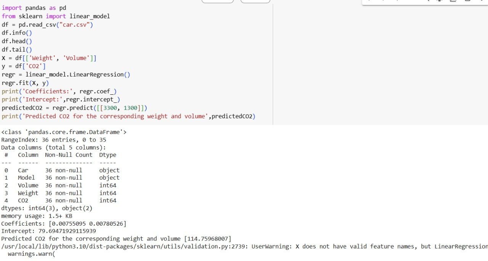

# Implementation of Multivariate Linear Regression
## Aim
To write a python program to implement multivariate linear regression and predict the output.
## Equipment’s required:
1.	Hardware – PCs
2.	Anaconda – Python 3.7 Installation / Moodle-Code Runner
## Algorithm:
### Step1
Import pandas as pd and read the CSV file containing data about car weight, volume and co2 into dataframe

### Step2
Select weight and volue as a input features(x) and co2 as target variable(y)


### Step3
Create a linear regression model linear_model.LinearRegression() and fit it to x and y

### Step4
Print the coefficients and intercepts of the trained regression model. Use the trained model to predict co2 for given weight and volume

### Step5
End the program

## Program:
```
import pandas as pd
from sklearn import linear_model
df = pd.read_csv("car.csv")
df.info()
df.head()
df.tail()
X = df[['Weight', 'Volume']]
y = df['CO2']
regr = linear_model.LinearRegression()
regr.fit(X, y)
print('Coefficients:', regr.coef_)
print('Intercept:',regr.intercept_)
predictedCO2 = regr.predict([[3300, 1300]])
print('Predicted CO2 for the corresponding weight and volume',predictedCO2)

```
## Output:



## Result
Thus the multivariate linear regression is implemented and predicted the output using python program.